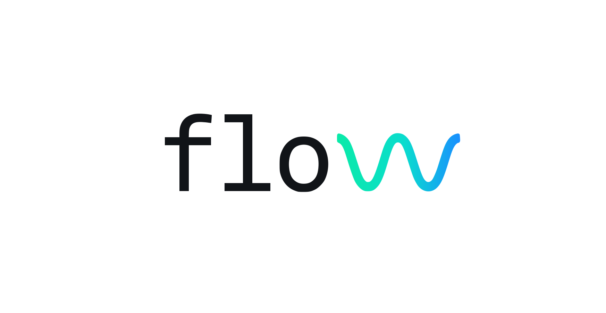

<p align="center">
  
</p>

<p align="center">
  <a href="https://facets-cloud.github.io/flow/"><strong>Website</strong></a> ·
  <a href="#install">Install</a> ·
  <a href="#see-it-in-action">Demo</a> ·
  <a href="CHANGELOG.md">Changelog</a>
</p>

<p align="center">
  
  
</p>

> A complete task manager for Claude Code and Codex — and the working memory
> layer that turns every session from a brilliant new hire into the
> engineer on your team.

## What flow is

flow is a local task manager for agentic coding work. It keeps your
projects, tasks, briefs, progress notes, playbooks, and durable
knowledge in `~/.flow/`, then loads the right context into Claude Code
or Codex whenever you start or resume work.

Use it when you want your coding agent to remember:

- what a task is trying to accomplish
- why earlier decisions were made
- where the repo and project context live
- what happened in previous sessions
- durable facts about you, your team, products, and process

Everything is local: markdown files plus a SQLite index. No server, no
account, no telemetry.

## Quickstart

### 1. Install

In Claude Code or Codex, paste:

> Install flow from https://github.com/Facets-cloud/flow

The agent downloads the latest binary and runs `flow init`. That one
setup step creates `~/.flow/`, installs the flow skill for the agent you
ran it from, and wires the SessionStart hook that makes future sessions
auto-load context.

Manual install is below if you prefer shell commands.

### 2. Start working

Open Claude Code or Codex and say:

> let's get to work

The flow skill will help you pick an existing task or create a new one.
When you start a task, `flow do <task>` opens or focuses the right
terminal tab and starts/resumes the matching Claude or Codex session.

### 3. Close the loop

When the task is done:

```bash
flow done <task>
```

flow marks it done and runs a best-effort transcript sweep so important
facts can be added to the knowledge base for future sessions.

## Common commands

```bash
flow init                         # first-time setup
flow add project "Auth" --work-dir ~/src/auth
flow add task "Fix token expiry" --project auth
flow list                         # active tasks
flow do fix-token-expiry          # start or resume work
flow do fix-token-expiry --with "check the upstream PR first"
flow update task fix-token-expiry --status backlog
flow transcript fix-token-expiry
flow done fix-token-expiry
```

You can mostly drive these through natural language in Claude or Codex.
The CLI is there when you want precision.

## See it in action

A four-act demo of how flow compounds context across days and tasks.
The work is silly on purpose — Star Trek bridge starships — so the
mechanic is what you watch, not the code.

**Act 1 — Capture the work.** Just talk. flow interviews you for
what / why / where / done-when, drafts a structured brief, and opens
a dedicated Claude or Codex session for the task in a new tab.


**Act 2 — Work, then park.** The session has the brief, the project
context, and the knowledge base loaded. You build until you hit a
blocker — here, "Kirk needs to review this" — and tell the agent to
park it. Status flips to `waiting`. Tab can close.


**Act 3 — Resume and close.** A day later you say "Kirk signed off."
Same session resumes with full memory of where it left off. `flow
done` flips status and triggers the sweep — the agent re-reads the
whole transcript and writes durable facts (Kirk approved the design,
the ship class, the conventions used) into the knowledge base.


**Act 4 — Months later, a new captain.** New task: "Picard's the new
boss, he wants the starship as an SVG." Brand new session, but it
already knows the ship, knows the design choices Kirk approved,
knows the project conventions — because the KB carried it. The agent
just gets to work.


That fourth session is what flow is really about. Not the first
session — the fiftieth.

## Why people use it

If you use Claude Code daily, you've felt the ceiling: every session
starts cold. Brilliant, capable, ready to help — but missing yesterday's
decisions, last week's migrations, and the half-finished threads in
your other tabs.

flow gives that work a durable home. Tasks get structured briefs.
Sessions get resumable identities. Completed work feeds a knowledge
base. Related tasks can read each other's transcripts. Over time, your
agent spends less time asking for context and more time doing the work.

## How context compounds

Every task feeds the same knowledge base. Every closed task makes
the next one smarter.

```
                                       ┌────────────────────────┐
                                       │   ~/.flow/kb/          │
                                       │   user · org · products│
                                       │   processes · business │
                                       └─────▲──────────▲───────┘
                                             │          │
                  flow do <task>             │ scoop    │ sweep
   ┌────────┐  ─────────────────▶  ┌─────────┴──────────┴─────┐
   │  Task  │                      │   Claude/Codex session   │
   │  brief │  ◀──── updates ───── │  loads brief + kb +      │
   │ +notes │                      │  notes + repo conventions│
   └────────┘  ─── flow done ───▶  └──────────────────────────┘
                                       (auto-sweep transcript
                                        into kb on done)
```

- **Scoop (live):** during a session the flow skill listens for
  durable facts you mention — your role, a teammate's name, a
  product convention — and appends them to the matching kb file
  on the fly.
- **Sweep (on `flow done`):** when you close a task, flow spawns
  a headless Claude or Codex pass that re-reads the entire transcript and
  pulls anything kb-worthy that the live scoop missed. The status
  flip is the contract; the sweep is best-effort.
- **Cross-reference:** `flow transcript <sibling-task>` lets a
  current session read what was decided in a related one — useful
  when the brief alone doesn't carry enough context.

Net effect: the longer you use flow, the more your knowledge base
grows, the less you re-explain yourself.

## Playbooks for the work you do on cadence

Some work repeats. Weekly reviews. Daily PR triage. On-call rotations.
Customer-meeting prep.

A **playbook** is a reusable run definition — a markdown brief that
describes what a run does. `flow run playbook weekly-review` snapshots
that brief into a fresh task and spawns a new Claude or Codex session
against it. Every run is reproducible (it executes against a frozen
snapshot, so editing the playbook later doesn't rewrite history) and
contributes back to the knowledge base on `flow done` like any other
task.

```
┌──────────┐  flow run playbook weekly-review
│ Playbook │ ────────▶ snapshot ─────▶ new task ─────▶ new session
│  brief   │           (frozen for                     (executes
└──────────┘            reproducibility)                against snapshot)
```

Same compounding mechanic — your weekly review session two months from
now will know everything every prior weekly review surfaced.

## Manual install

Use this path if you would rather install from a shell instead of
asking Claude to do it.

```bash
# 1. Download the binary for your Mac.
ARCH=arm64        # Apple Silicon (M1/M2/M3/M4) — use amd64 for Intel.

curl -fsSL -o /usr/local/bin/flow \
  "https://github.com/Facets-cloud/flow/releases/latest/download/flow-darwin-${ARCH}"
chmod +x /usr/local/bin/flow
xattr -d com.apple.quarantine /usr/local/bin/flow 2>/dev/null || true

# 2. Initialize. This is required — it creates ~/.flow/, the SQLite
#    index, the knowledge base, and installs the skill + SessionStart
#    hook for the detected agent harness. From a plain shell, Claude is
#    the default.
flow init
```

`flow init` is the step that wires flow into your agent harness. It:

- Creates `~/.flow/` (database, kb, projects, tasks, playbooks)
- Writes the flow skill to the harness skill directory, such as
  `~/.claude/skills/flow/SKILL.md` or `~/.codex/skills/flow/SKILL.md`
- Adds the harness SessionStart hook so new sessions auto-load the skill

If you use both Claude Code and Codex, run `flow skill install` once
from the other agent too. flow stores which harness owns each task the
first time you run `flow do`.

The `xattr` step removes Gatekeeper's quarantine attribute so macOS
doesn't refuse to run the unsigned binary.

### For those who use Claude's agents view

`flow do` and `flow run` don't pass `--bg` today — the aliases below
will, so flow's sessions (and your own direct invocations) land in
the agents view. Add to your shell rc (`~/.zshrc` or `~/.bashrc`) and
`source` it.

```bash
# Bare `claude` now drops into the agents view. Add
# `--dangerously-skip-permissions` if you'd also like dispatched
# sessions to skip per-tool permission prompts (optional flavor).
alias claude='claude --bg'

# Since `claude` is now aliased, any `claude <sub>` invocation would
# also pick up `--bg`. For each subcommand you use, add an alias that
# routes through `command claude` to bypass the outer alias. The one
# below is for the agents subcommand — the same shape works for
# `mcp`, `doctor`, etc.
alias ca='command claude agents'
```

## Upgrade

In any Claude Code session:

> Upgrade flow from https://github.com/Facets-cloud/flow

Claude fetches the latest release binary and runs `flow skill
update` to refresh the skill and re-wire the SessionStart and
UserPromptSubmit hooks. Check the running version with
`flow --version`.

## What you get

- **One task, one harness session, one tab.** `flow do <task>`
  spawns a dedicated tab in iTerm2, Warp, Ghostty, stock macOS
  Terminal, kitty (requires `allow_remote_control yes` in
  `kitty.conf`), or your current zellij session (requires zellij ≥
  0.40) — flow picks whichever you launched it from. Override with
  `FLOW_TERM=warp|ghostty|iterm|terminal|zellij|kitty` when you're on a
  non-standard host. It auto-detects Claude vs Codex from the current
  session, stores that harness on the task, and tomorrow's
  `flow do <task>` resumes the same conversation.
- **Interview-driven task capture.** No forms. flow asks
  what / why / where / done-when, then writes a structured brief.
- **A knowledge base that grows.** Five markdown buckets for
  durable facts about you, your team, products, processes, and
  customers. Live-appended during sessions; auto-swept from
  transcripts on `flow done`.
- **Per-task progress notes.** Append-only logs. Pick up where
  you left off, even after a week away.
- **Playbooks for cadence work.** Weekly reviews, daily triage,
  on-call rotations — define once, run on demand.
- **A Claude/Codex skill that speaks plain English.** "What should I
  work on", "resume auth", "save a note" — the skill turns intent
  into flow commands.

## How it works under the hood

`flow do <task>` detects the invoking agent harness, then spawns a tab
in zellij (when `$ZELLIJ` is set), kitty (when `$KITTY_WINDOW_ID` is
set or `$TERM=xterm-kitty`), the backend named in `$FLOW_TERM` (when
set), or Warp / Ghostty / iTerm2 / stock Terminal.app (auto-detected
from `$TERM_PROGRAM`) — chosen in that priority order, with iTerm as
the historical fallback. Claude remains the default: flow pre-allocates
a UUID, stores it as the task's Claude session, and runs
`claude --session-id <uuid>` or `claude --resume <uuid>`. For Codex,
flow first runs a short `codex exec --json` probe to mint a real session
id, stores that id on the task, and launches or resumes with
`codex resume <session-id>`. `flow transcript <task>` uses the task's
stored harness to render the right transcript format.

When `flow do <task>` is run for a task whose session is already
live in another tab, flow focuses that tab instead of spawning a
duplicate. The source tab prints "Already open: `<slug>` — switched
to existing tab" as an audit line.

The first `flow do` from stock Terminal.app needs macOS Accessibility
permission for the **app hosting your shell** — not the `flow` binary
itself. Terminal.app's AppleScript dictionary has no "make new tab"
verb, so flow drives cmd-T through System Events, and System Events
checks Accessibility against the responsible parent app. Until that's
granted, `flow do` errors out with a multi-line explanation pointing at
System Settings → Privacy & Security → Accessibility (enable the
toggle for "Terminal" if you launched flow from Terminal.app, "iTerm"
from iTerm2, "Claude" if Claude Code is the host, etc.; add it via the
+ button if it's not listed). After the grant the spawn is silent.
iTerm2 doesn't need this — it has a native `create tab` verb.

### One-shot instructions with `--with`

`flow do <task> --with "<instruction>"` resumes (or starts) the task's
session and injects the instruction as the first user message —
prefixed with `[via flow do --with]` so the model can tell injected
input from typed input.

`--with-file <path>` is the same idea for longer instructions: instead
of embedding the file contents, flow injects `read instructions at
<absolute path>` and the session uses its Read tool to load the file.
No size limits. The flags are mutually exclusive, and cannot be
combined with `--here` (there's no spawned session to inject into).

```bash
# Nudge a parked task without opening the tab.
flow do auth --with "check if upstream PR merged and update the brief if so"

# --with on a done task auto-rolls it back to in-progress, so playbooks
# can fire on previously-closed work.
flow do auth --with "are we still blocked on the security review?"

# Hand the session a longer brief to follow.
flow do auth --with-file ~/playbooks/triage-checklist.md
```

This is the lane scheduled playbooks use to fire instructions at
existing tasks without manual intervention. `flow run playbook <slug>`
accepts the same flags for ad-hoc per-run instructions.

## Your data — local, portable, yours

Everything flow stores lives under `~/.flow/` (override with
`$FLOW_ROOT`). No server, no cloud, no telemetry. Plain markdown
beside a SQLite index — readable in any editor, versionable in git.

```
~/.flow/
  flow.db                          # SQLite — projects, tasks, playbooks index
  kb/
    user.md  org.md  products.md
    processes.md  business.md      # 5 markdown buckets, append-only
  projects/<slug>/
    brief.md
    updates/YYYY-MM-DD-*.md
  tasks/<slug>/
    brief.md
    updates/YYYY-MM-DD-*.md
  playbooks/<slug>/
    brief.md
    updates/YYYY-MM-DD-*.md
```

The SQLite database is an *index*, not the source of truth — every
task and project has its real content in the markdown files next to
it. You could delete `flow.db` and rebuild it from the markdown if
you had to.

### Backup & sync

Pick whichever fits your workflow:

- **Git (recommended for single-user history).**
  ```bash
  cd ~/.flow && git init && git add . && git commit -m "initial"
  ```
  Commit periodically. The SQLite file is binary, so diffs aren't
  useful, but each commit is a clean snapshot. **If you push to a
  shared remote**, add `kb/` to `.gitignore` first — kb files often
  contain personal or org-sensitive notes you don't want public.

- **Time Machine / system backup.** Just works, no setup.

- **iCloud Drive / Dropbox / Google Drive.** Symlink `~/.flow` into
  the synced folder:
  ```bash
  mv ~/.flow ~/Library/Mobile\ Documents/com~apple~CloudDocs/flow
  ln -s ~/Library/Mobile\ Documents/com~apple~CloudDocs/flow ~/.flow
  ```
  ⚠️ **Don't run flow on two machines simultaneously** through a
  synced folder — SQLite doesn't tolerate concurrent writes from
  separate hosts and you can corrupt `flow.db`. Use this for backup
  + occasional second-machine access, not active multi-machine use.

- **Manual rsync.** `rsync -a ~/.flow/ /path/to/backup/flow/` on a
  schedule. Same caveat about concurrent writes.

To move flow to a new machine: copy `~/.flow/` over, install the
binary, and run `flow init` once — it'll pick up the existing data
and reinstall the skill + hook.

## Where flow runs (and where we'd love help)

Today flow runs on **macOS with Claude Code and Codex**. The terminal
spawn layer supports iTerm2, Warp, Ghostty, stock Terminal.app, kitty,
and zellij. zellij and kitty also work on Linux as a side effect because
those backends do not depend on macOS APIs.

Kitty needs `allow_remote_control yes` (or `socket-only`) in
`kitty.conf` so flow can drive `kitty @ launch` from inside the running
kitty instance.

The architecture is portable — session spawning is one small package —
but more harnesses and terminals still need contributors who run those
stacks daily. Cursor, tmux/wezterm, Windows Terminal, and deeper Linux
coverage are all good candidates. If that's you, [a PR is very
welcome](CONTRIBUTING.md).

## Where flow came from

flow started as an internal tool at Facets. We use Claude Code every
day, and the context-loss problem was eating into how much of the
tool's capability we could actually use. flow fixed that for us — to
the point where we couldn't imagine working without it. We're
open-sourcing it as-is because it might do the same for you.

This is not a Facets product. There's no signup, no cloud, no upsell.
Just the tool we built for ourselves.

## Docs & contributing

- [Contributing](CONTRIBUTING.md) — bug reports, PRs, dev setup
- [Changelog](CHANGELOG.md)
- [Security](SECURITY.md) — how to report issues
- [Code of Conduct](CODE_OF_CONDUCT.md)

## License

[MIT](LICENSE) — © 2026 Facets Cloud
