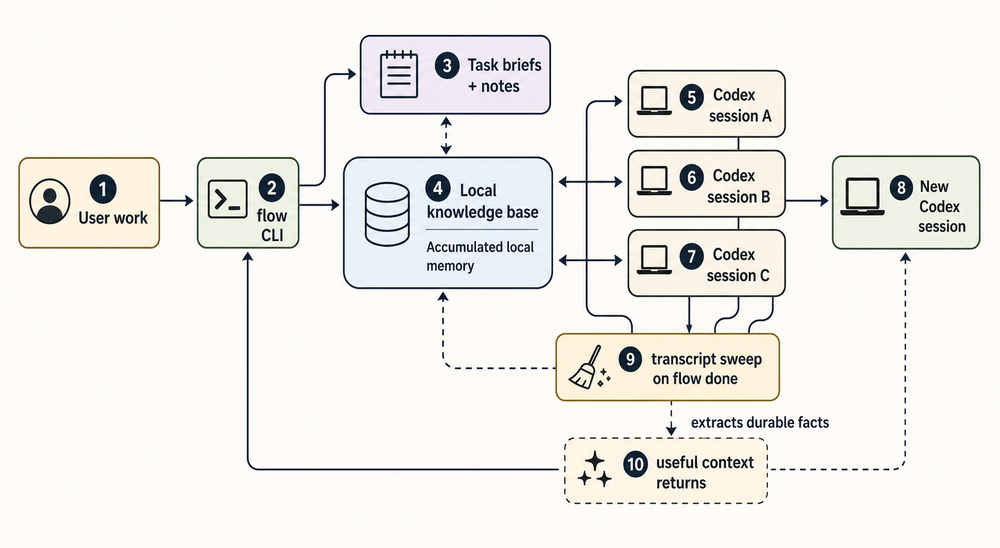

# flow-codex

 

> A local task manager and working-memory layer for Codex. It turns
> isolated coding chats into a continuous working relationship with
> durable project context.

This fork is based on the original
[`Facets-cloud/flow`](https://github.com/Facets-cloud/flow) project. The
original repo describes its goal as turning isolated Claude sessions into
a continuous working relationship. `flow-codex` keeps that goal, but
ports the session backend, skill install path, hooks, transcript reader,
and close-out sweep to Codex.



## Why flow-codex

Codex sessions are powerful, but each new session starts with limited
memory of what happened in other tabs, yesterday's debugging, or a
decision made three tasks ago. You end up re-explaining context.

flow-codex creates a local memory layer around Codex:

- Tasks and projects are captured as structured markdown briefs.
- Progress notes are appended as dated markdown files.
- Durable facts are stored in local knowledge-base files.
- Each task gets a dedicated Codex session that can be resumed later.
- On close-out, the task transcript can be swept for useful learnings
  and written back to the local memory layer.

The result is simple: chat 1, chat 2, and chat 3 can leave useful traces
in local memory; chat 4 can load that accumulated context instead of
starting cold.

## Is This RAG?

It is **RAG-like**, but not a full vector RAG system yet.

What it already does:

- Stores durable context locally in markdown and SQLite.
- Injects relevant task/project context into Codex sessions through the
  `flow` skill and Codex hooks.
- Lets Codex read sibling-task transcripts through `flow transcript`.
- Runs a close-out sweep on `flow done` to extract durable facts from the
  transcript into the knowledge base.

What it does not yet do:

- No embeddings.
- No vector database.
- No semantic nearest-neighbor retrieval.
- No automatic ranked retrieval across every memory item.

So the honest framing is: **flow-codex is a local, structured working
memory layer for Codex. It behaves like a lightweight RAG/control-plane
system, but the retrieval mechanism is currently explicit, markdown-first,
and skill-guided rather than embedding-based.**

## How It Compares To Supermemory

Supermemory describes itself as a memory/context layer for AI with
memory, RAG, user profiles, connectors, retrieval, and graph features.
flow-codex is in the same broad category of "persistent memory for AI
agents", but it is intentionally smaller and local-first:

- Supermemory: general memory infrastructure/API across many apps,
  connectors, profiles, graph, hybrid retrieval, hosted/self-hostable
  options.
- flow-codex: local CLI for Codex task work, markdown briefs, SQLite
  index, Codex hooks, and transcript sweeps.

flow-codex is closer to a personal operating layer for coding sessions.
Supermemory is closer to a general-purpose context infrastructure product.

## How Context Compounds

Every task contributes to the same local memory.

```text
User intent
  -> flow add task/project
  -> markdown brief + SQLite index
  -> flow do <task>
  -> dedicated Codex session
  -> progress notes + transcript
  -> flow done <task>
  -> transcript sweep
  -> local KB / project updates
  -> future Codex sessions load better context
```

The knowledge base lives in five local buckets:

```text
~/.flow/kb/
  user.md
  org.md
  products.md
  processes.md
  business.md
```

These files are plain markdown. You can inspect, edit, back up, or git
version them like any other local file.

## What You Get

- **One task, one Codex session, one tab.** `flow do <task>` opens a
  dedicated terminal tab. Later runs resume that same Codex session.
- **Task briefs instead of vague chats.** Work starts from a captured
  brief: what, why, where, done-when, out of scope, open questions.
- **Local knowledge base.** Durable facts about you, your org, products,
  processes, and business context accumulate under `~/.flow/kb/`.
- **Progress notes.** Each task/project gets append-only dated updates.
- **Transcript lookup.** `flow transcript <task>` turns a Codex JSONL
  session transcript into readable text.
- **Close-out sweep.** `flow done <task>` can run a headless
  `codex exec` pass to extract durable learnings from the transcript.
- **Playbooks.** Repeatable workflows can be snapshotted into task runs.
- **Codex-native installation.** The skill installs to
  `~/.codex/skills/flow/SKILL.md`; hooks install to `~/.codex/hooks.json`.

## Install From Source

```bash
make build
make install
flow init
```

`flow init` creates `~/.flow/`, initializes the SQLite database and
knowledge-base files, installs the Codex skill, installs Codex hooks, and
enables the `codex_hooks` feature in `~/.codex/config.toml`.

`flow do <task>` opens a new terminal tab that runs `codex`, so the Codex
CLI must be available on the shell `PATH` used by Terminal.app or iTerm2.
If Codex is bundled inside another app, add or symlink its `codex` binary
into a directory such as `~/.local/bin` that your terminal shell can see.

After install, restart Codex so it discovers the skill.

## Daily Use

In Codex, say:

> let's get to work

The installed `flow` skill can list your active work, help you add tasks,
save progress notes, and open a task in a dedicated Codex tab.

Useful commands:

```bash
flow list tasks
flow add task "Fix onboarding bug" --slug onboarding-bug --work-dir /path/to/repo
flow do onboarding-bug
flow transcript onboarding-bug
flow done onboarding-bug
```

## How Codex Sessions Work

On the first `flow do <task>`, flow starts:

```bash
codex "<bootstrap prompt>"
```

Codex generates its own session ID. The Codex `SessionStart` hook receives
the session ID and transcript path, then writes them back to the task row.

Later `flow do <task>` calls start:

```bash
codex resume <session-id>
```

The bootstrap prompt and hook tell Codex to:

1. Invoke the `flow` skill.
2. Run `flow show task`.
3. Read the task brief and updates.
4. Read the project brief and updates if attached.
5. Review `AGENTS.md` guidance.
6. Only then start work.

If you pass:

```bash
flow do <task> --dangerously-skip-permissions
```

flow forwards Codex's bypass flag:

```bash
--dangerously-bypass-approvals-and-sandbox
```

Use that only when you trust the workspace.

## Data Layout

```text
~/.flow/
  flow.db
  kb/
    user.md
    org.md
    products.md
    processes.md
    business.md
  projects/<slug>/
    brief.md
    updates/*.md
  tasks/<slug>/
    brief.md
    updates/*.md
  playbooks/<slug>/
    brief.md
    updates/*.md
```

The markdown files are the readable source of truth. SQLite is the fast
index used by the CLI.

## macOS Terminal Permissions

flow can open Codex in iTerm2 or stock macOS Terminal.app. iTerm2 uses a
native tab API. Terminal.app requires macOS Accessibility permission
because AppleScript has to send Cmd-T through System Events.

If `flow do` reports an Accessibility error, grant permission to
**Terminal**, not Codex and not the `flow` binary:

```bash
open "x-apple.systempreferences:com.apple.preference.security?Privacy_Accessibility"
```

Then enable Terminal in the Accessibility list and retry the same
`flow do` command.

## Verification

Current verification covers:

- Codex launch and resume command construction.
- Codex dangerous bypass flag ordering.
- iTerm2/Terminal.app backend detection and Terminal fallback when iTerm
  is unavailable.
- Codex skill install path.
- Codex hook install/uninstall/idempotency.
- `codex_hooks = true` config enablement.
- Hook-based session ID and transcript path registration.
- Fresh Codex session registration refreshes `session_started`.
- Resume hook bookkeeping.
- Codex JSONL transcript rendering, including tool calls and tool output.
- Transcript path lookup by stored `transcript_path`.
- Fallback scan of `~/.codex/sessions`.
- Backward-compatible old Claude transcript lookup.
- Full CLI round trip using mocked terminal and Codex runners.

Run:

```bash
go test ./...
go build -o flow .
```

Tests use temp `$FLOW_ROOT` and `$HOME` values so they do not touch your
real `~/.flow/` or `~/.codex/` directories. External commands such as
terminal spawning and `codex exec` are mocked in tests.

## Development

This repo uses Go and pure-Go SQLite via `modernc.org/sqlite`.

```bash
go test ./...
go build -o flow .
```

Repo conventions for Codex live in [AGENTS.md](AGENTS.md).

## Upstream

Original project:

```text
https://github.com/Facets-cloud/flow
```

This fork keeps upstream history and credits while changing the primary
agent backend to Codex.

## License

[MIT](LICENSE)
